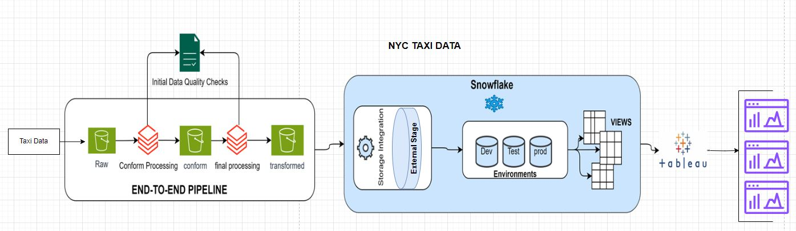

# Group 3 Mission Statement: Make You Money, Save You Money

## This project aims to use TLC Trip Records to Implement Dynamic Pricing Strategies For a NYC Taxi Corporation

This is the Tech Cat Repo.

The group members are:
- Joseph Cocozza
- Ginamarie Mastrorilli
- Jason Juncker
- Andy Amoah Mensah

# Overview
To achieve our mission statement for this Project we leveraged TLC Trip Record Data by technology providers authorized under the Taxicab & Livery Passenger Enhancement Programs (TPEP/LPEP). This Data had Yellow and green taxi records which included fields capturing pick-up and drop-off dates/times, pick-up and drop-off locations, trip distances, itemized fares, rate types, payment types, and driver-reported passenger counts. After cleaning and transfroming this data we gain valuable insights on : 
- #### How To Build a Dynamic Pricing System Based on Collisions and Rides
- #### Discovered How To Implement Sophisticated Route Optimization Procedures That Can Be Used To Make Money As Well As To Save Money
- #### Optimizing Taxi Revenue By Supplementing the City's Other Public Transit Offerings


# Details of How Our Strategy is Implemented
- How To Build a Dynamic Pricing System Based on Collisions and Rides:

    -   This set of dashboards allows users of NYC Taxi Corporaton to identify peak rider demand times in collison hot spots to implement a dynamic pricing strategy. The dashboards aim to aid in maximizing revenue and incentivze riders to travel during low-risk hours. The first visualization is the average ride count by day of week and time of day. The user can identify the most popular and least popular demand times for NYC Taxi Corporation. The next visualization is the count of collisions by borough. The user can see an overview of which boroughs have the highest proportion of collisions. Next, the user can see summary statistics for each Borough such as average fare amount and average trip distance. This allows users to see if any Borough is not reaching the benchmark for any area. The next visualizaition is a map of collisions in NYC based on Zip Code. This map can be filtered by Borough and Day of Week. In the second dashboard of this set, the user can see the ride count during each hour of the day, filtered by Borough and Day of Week. This visualization can then be compared to the collisions by hour bar chart which identifys which hours of the day have the highest collision count. Both of these charts can be filtered by Borough and Day of Week to have a deeper level of granualarity in their analysis. Finally, based on the analysis of all of the previous visualizations, the user can implement dynamic pricing by following the last visualization. This shows, for each borough, at which hour how much pricing should increase.

- Optimizing Taxi Revenue By Supplementing the City's Other Public Transit Offerings:
    - brief over here and ask them to look at powerpoint

- Discovered How To Implement Sophisticated Route Optimization Procedures That Can Be Used for Making Money and Saving Money:

    -  we solve this by utilizing route optimization which is finding th shortest, most cost-effective routes between multiple destinations, while meeting reall-world needs and business constraints. This is important because large companies like fedex, amazon, and your compitetors uber spend billions try to harness this data and build their own in house product.Lucky for us we struck gold because with just 8 months of data we are able to come with a dashboard, which we used to show the shortest trip  for picking up passangers and dropping them off and you can also see what time is most popular. All with just pure analytics. This make you money by solving deadhead problems with long trips and find the best routes to do multiple short hand rides without wasting too much navigating through traffic or trying to find passengers. This saves you money by making your rides so efficient that your drivers no longer have to waist fuel sitting idle or going through unnessary traffic. And you don't waste a lot of money on constant maintenance because the vechical is now being driven in an efficient manner.
    
# Technical Implementation


It all starts in the Src folder which contains the main pipeline code as well as the sql code for the database.

## Technologies
We used the following technologies in this pipeline:
- [Jira](https://penfoldslaws.atlassian.net/jira/software/projects/TC/boards/2?sprintStarted=true)
- Snowflake
- AWS S3
- Tableau
- Databricks Notebooks + Pyspark

## Diagram


## Analysis
A brief analysis was performed at the beginning of the project.

The details are provided in markdown files in that folder.

## SQL
The sql folder contains the code necessary to replicate the schema of the data warehouse in full.
It is broken down by stages, tables, views, and file_formats.

## main
The `main.py` file is orchestrates the entire pipeline, end to end.

It is structured to be used as a single cell in a databricks notebook.

Note that databricks does not come with snowflake-connector-python installed. You will have to install it yourself.
In the notebook, simply run: `%pip install snowflake-connector-python`.

The only things that need to be modified are the user defined variables:
```python
ENVIRONMENT = "dev"  # or "prod"

AWS_ACCESS_KEY = ""
AWS_SECRET_KEY = ""

SNOWFLAKE_USER = ""
SNOWFLAKE_PASSWORD = ""
SNOWFLAKE_ROLE = ""
SNOWFLAKE_ACCT = ""
SNOWFLAKE_WAREHOUSE = ""
SNOWFLAKE_DB = ""
SNOWFLAKE_SCHEMA = ""
```
The script allows for `dev` and `prod` modes.

The basic structure of the pipeline is as follows.

1. Read from raw S3 bucket.
2. Perform initial transformations. The initial processing is done in the following two methods.
```python
@timefunc
def process_yellow_taxi(sess: SparkSession) -> DataFrame:
    """
    process the yellow taxi data
    """
    date_col = "pickup_datetime"
    yellow_taxi_df = read_df(sess, YELLOW_TAXI_URL)
    yellow_taxi_df = yellow_taxi_df.drop_duplicates() \
        .withColumnRenamed("tpep_dropoff_datetime", "dropoff_datetime") \
        .withColumnRenamed("tpep_pickup_datetime", "pickup_datetime") \
        .withColumn("taxi_type", lit("yellow")) \
        .withColumn("trip_duration",
                    (unix_timestamp(col("dropoff_datetime"))
                     - unix_timestamp(col("pickup_datetime"))) / 60) \
        .withColumn("average_speed",
                    col('trip_distance') / (col('trip_duration') / 60)) \
        .withColumn("month", month(col(date_col))) \
        .withColumns({'time': date_format(col(date_col), 'HH:mm:ss'), 'hour': date_format(col(date_col), 'HH')})\
        .withColumn('timeofday', when(date_format(col(date_col), 'HH')<12, 'Morning').when(date_format(col(date_col), 'HH').between(12,17),'Afternoon').otherwise('Evening')) \
        .withColumn("day_of_month", dayofmonth(col(date_col))) \
        .withColumn("year", year(col(date_col))) \
        .withColumn("day_of_week", date_format(col(date_col), 'EEE')) \
        .withColumn("is_weekend", when(col("day_of_week").isin([1, 7]), True)
                    .otherwise(False)) \
        .withColumn("ehail_fee", lit(0)) \
        .withColumn("trip_type", lit(-1))
    return yellow_taxi_df


@timefunc
def process_green_taxi(sess: SparkSession) -> DataFrame:
    """
    process the green taxi data
    """
    date_col = "pickup_datetime"
    green_taxi_df = read_df(sess, GREEN_TAXI_URL)
    green_taxi_df = green_taxi_df.drop_duplicates() \
        .withColumnRenamed("lpep_dropoff_datetime", "dropoff_datetime") \
        .withColumnRenamed("lpep_pickup_datetime", "pickup_datetime") \
        .withColumn("taxi_type", lit("green")) \
        .withColumn("trip_duration",
                    (unix_timestamp(col("dropoff_datetime"))
                     - unix_timestamp(col("pickup_datetime"))) / 60) \
        .withColumn("average_speed",
                    col('trip_distance') / (col('trip_duration') / 60)) \
        .withColumn("month", month(col(date_col))) \
        .withColumns({'time': date_format(col(date_col), 'HH:mm:ss'), 'hour': date_format(col(date_col), 'HH')})\
        .withColumn('timeofday', when(date_format(col(date_col), 'HH')<12, 'Morning').when(date_format(col(date_col), 'HH').between(12,17),'Afternoon').otherwise('Evening')) \
        .withColumn("day_of_month", dayofmonth(col(date_col))) \
        .withColumn("year", year(col(date_col))) \
        .withColumn("day_of_week", date_format(col(date_col), 'EEE')) \
        .withColumn("is_weekend", when(col("day_of_week").isin([1, 7]), True)
                    .otherwise(False)) \
        .withColumn("Airport_fee", lit(0))
    return green_taxi_df
```
3. Write to the conformed S3 bucket.
4. Final data filtering and transforming.
```python
@timefunc
def process_yellow_green(sess: SparkSession) -> tuple[DataFrame, DataFrame]:
    """
    process conformed yellow/green and produce outliers report
    """
    yg_df = read_df(sess, YELLOW_GREEN_URL)

    # a fare amount of >150 is considered a flag for fraud
    outliers_report = yg_df.filter((col("fare_amount") > 150) | (col("trip_distance") >= 60))

    # filter outlier trip distances: 60 is the 99.99 percentile
    yg_df = yg_df.filter(col("trip_distance") < 60)
    # we replace 0 valued distance with the average distance per business request
    average_distance = yg_df.filter(col("trip_distance") != 0).agg(avg(col("trip_distance"))).collect()[0][0]
    yg_df = yg_df.withColumn("trip_distance", when(col("trip_distance") == 0, average_distance).otherwise(col("trip_distance"))) \
        .withColumn("passenger_count", when((col("passenger_count") == 0) | (col("passenger_count").isNull()), lit(1)).otherwise(col("passenger_count")))
    return yg_df, outliers_report
```
5. Write to transformed S3 bucket. Then load into snowflake via stage.
```sql
sql = f"""COPY INTO {fact_tbl}
FROM @capstone_de.group_3_schema.group_3_S3_stage_yellow_green
ON_ERROR='CONTINUE'
MATCH_BY_COLUMN_NAME='CASE_INSENSITIVE';
"""
copy_into(snow_conn, sql, AWS_ACCESS_KEY, AWS_SECRET_KEY)

sql = f"""COPY INTO {outlier_tbl}
FROM @capstone_de.group_3_schema.group_3_S3_stage_outlier_report
ON_ERROR='CONTINUE'
MATCH_BY_COLUMN_NAME='CASE_INSENSITIVE';
"""
copy_into(snow_conn, sql, AWS_ACCESS_KEY, AWS_SECRET_KEY)
```

6. Finally, a log file is written to S3.


