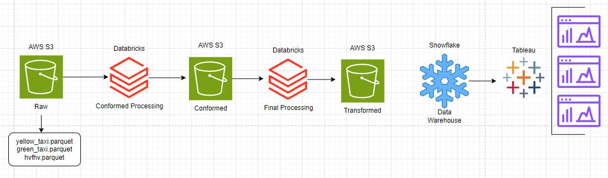

# Tech Catalyst Data Engineering Capstone
### Group 3
Ginamarie Mastrorilli, Joseph Cocozza, Andy Amoah Mensah & Jason Juncker

## Project Overview
NYC Taxi Corporation engaged a team of coluntants from the Tech Catalyst Data Engineering Program to assist with implementing a dynamic pricing system. The team must identify areas where revenue can be increased by reducing risk or modifying the amount of drivers in the area. The scope of the project involves creating a data pipeline to extract the raw data from S3, perform necessary transformations, load the data into a Conformed S3 bucket, and finally into a Transformed S3 bucket before importing it into Snowflake for final analysis using Tableau. Our team must create a implementation plan for NYC Taxi Corporation in moving forward with the next steps for further enhancements to the business. 

## Reference Architecture Diagram

